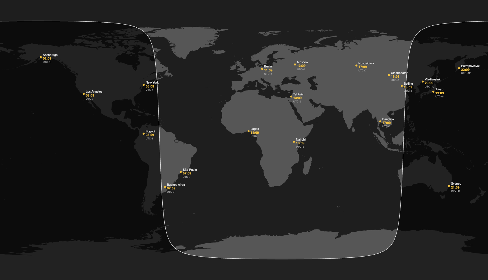

# WorldClockWallpaper

A macOS menu bar app that renders an interactive world map with live city clocks as your desktop wallpaper.



## Features

- World map rendered directly onto the desktop (below Finder icons, above the background color)
- Live clocks for any city, updated every second
- Night/day overlay with terminator line, recalculated every minute
- Add cities by name — coordinates and timezone resolved automatically via CoreLocation
- Drag to reorder, click to remove
- One wallpaper window per screen; responds to display configuration changes
- Launch at login support

## Installation (pre-built)

Download the latest `WorldClockWallpaper.zip` from [Releases](../../releases), unzip, and move `WorldClockWallpaper.app` to `/Applications`.

Since the app is not notarized, macOS will block it on first launch. To open it:

**Option A — Right-click:**
Right-click the app in Finder → Open → Open (in the dialog that appears).

**Option B — Terminal:**
```bash
xattr -cr /Applications/WorldClockWallpaper.app
```

You only need to do this once.

## Requirements (for building from source)

- macOS 13 Ventura or later
- Xcode 15 or later
- [XcodeGen](https://github.com/yonaskolb/XcodeGen) (`brew install xcodegen`)

## Build & Run

```bash
xcodegen generate   # regenerate .xcodeproj from project.yml
make build          # build with xcodebuild
make run            # build, stop any running instance, launch
make kill           # stop the running instance
```

## Development

Open `map.html` directly in a browser for rapid iteration on the map rendering:

```bash
make dev   # starts a local HTTP server and opens map.html
```

### Architecture

The app uses a two-layer rendering approach:

- **Swift** manages the app lifecycle, city data, and passes updates to a `WKWebView` via a JavaScript bridge (`window.updateCities()`)
- **Web** (`map.html`) uses [D3.js](https://d3js.org) + [TopoJSON](https://github.com/topojson/topojson) to render the world map, city pins, and live times

```
CityManager (UserDefaults persistence)
    → AppDelegate (Combine subscription)
    → MapViewController.updateCities()
    → WKWebView JS bridge → map.html D3 rendering
    → SettingsView (SwiftUI popover)
```

### Key files

| File | Role |
|------|------|
| `AppDelegate.swift` | Creates one wallpaper window per screen, observes CityManager |
| `CityManager.swift` | ObservableObject, UserDefaults persistence, add/remove/reorder |
| `MapViewController.swift` | WKWebView wrapper, Swift→JS bridge |
| `WallpaperWindow.swift` | Desktop-level NSWindow, ignores mouse events, spans all spaces |
| `map.html` | D3.js world map, night overlay, city pins, live clock updates |
| `SettingsView.swift` | SwiftUI settings popover |
| `CityLookupService.swift` | CLGeocoder-based city search |

### App Sandbox

The app runs without the macOS sandbox (`com.apple.security.app-sandbox = false`). This is intentional: `WKWebView` loads local HTML/JS/JSON resources via `loadFileURL(_:allowingReadAccessTo:)`, which requires access to the app bundle directory — a permission that is not available under the default sandbox policy without additional entitlements.

## License

MIT
